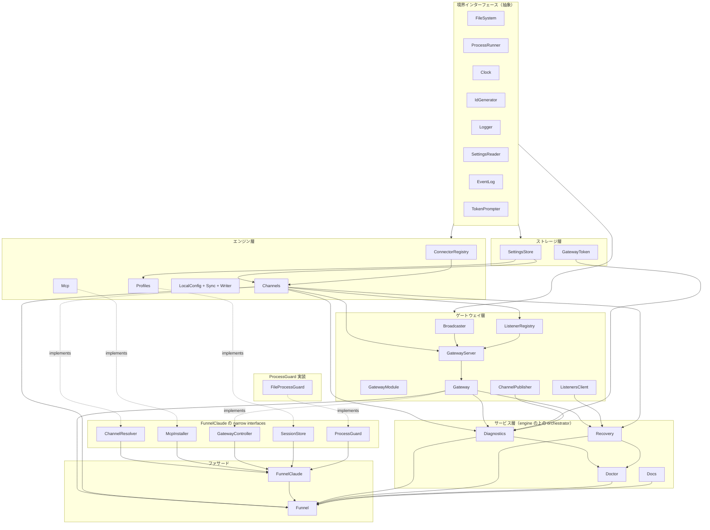

# CLAUDE.md

このリポジトリでコードを扱うときの案内。詳細は対応するソースを直接読むこと。ここは地図に徹する。

## プロジェクト概要

Open Claude Funnel (`funnel` / `fnl`) は、複数の Claude Code エージェントと外部サービス（Slack 等）を統合管理するハブ。外部の通知を購読箱に流し、各 Claude が購読箱経由でイベントを受け取る。

```
external sources → daemon → channel → agent (MCP)
                       ↑ ← outbound replies (MCP tools)
```

CLI とプログラマブル API (`new Funnel(...)`) を 1 つの core から共有する。Web UI は持たない。

## ドメイン語彙

新しい機能を足すときはここで概念の置き場所を決める。

### Channel

購読箱（transport）。`{ id, name, delivery, connectors[] }` を持ち、複数の Connector を nest する単位。WS クライアントはチャネル名で subscribe する。Channel は「event がどこから来てどこへ返るか」だけを持ち、launch 設定（options/env/resume）は持たない（それは Profile の責務）。`delivery` は 2 種類。

- `fanout` — 全 subscriber が全 event を受信する。各 subscriber が独立した仕事を持つ場合（複数 Profile が同じ source を別々に処理する、観察用クライアントが覗くなど）
- `exclusive` — 1 event を 1 subscriber が round-robin で消費する。subscriber が交換可能な worker で、各 event を 1 回だけ処理させたい場合

### Channel manifest（`/channel` サブエントリ）

上記の Channel（settings.json 上の transport 概念）と同名だが別系統の、プログラマブルな inbound 定義。`{ id, name?, build }` の宣言的 manifest を `FunnelChannelSupervisor` に register すると、`build(ctx)` が返す flume sources を 1 つの `FlumeConfluence` に挿し、event を optional な transform 経由で broadcaster に流す。ConnectorDescriptor 系（Listener Registry）とは独立に並走する段階的移行用 API。実体は `lib/engine/channel/`、公開は `@interactive-inc/claude-funnel/channel`。supervisor は gateway 具象でなく engine 側の narrow interface `ChannelBroadcastSink` に依存する（`FunnelBroadcaster` が構造的に満たす）。per-channel state は `ctx.statePersister<S>(filename)` が `<dir>/channels/<channelId>/<filename>.json` に書く。`timeChannel({ id, cron, transform })` が最初の具体 channel。

### Connector

外部サービスとの 1 つの接続。`slack` / `gh` / `discord` / `schedule` の 4 型。Channel に nested で持つ（1 Channel に複数 Connector）。型ごとの内訳：

- Listener — 外部 → Funnel の入口。push（Slack Socket Mode）か pull（GitHub poll）か tick（Schedule cron）かは型による
- Adapter — Claude → 外部の出口（callable な型のみ。schedule にはない）
- Schema / EventProcessor — 設定と event 整形

### Profile

transport model（Channel + Connector）の外側にある launch 便宜レイヤ。起動に必須ではなく（`fnl claude --channel <name>` だけで起動できる）、preset を保存しておきたいときだけ使う。machine-global な Claude 起動 preset で、`{ id, name, path, channelId, options[], env, resume, sessionId? }` で `~/.funnel/settings.json` に nested。`id` は不変の uuid 主キー（rename しても追従させたい内部 state — PID ファイルと sessionId — のキー）、`name` は CLI が指す表示用ラベルで rename 可能（`--profile <name>`）。`fnl claude --profile <name>` で path（cwd）に移動し、`FUNNEL_CHANNEL_ID` を注入して Claude を起動する。launch 固有の設定 — `--agent` / `--brief` / `--model` などの `options`（claude argv の先頭に積む）、`env`（process.env が衝突時に勝つ）、`resume`（session 再利用の可否）— は全部 Profile が持つ。`sessionId` は config でなく execution state で、この profile が最後に起動した Claude session id（launcher が書き、次回 resume で読む）。session を profile（by id）に内包することで、同じ repo の無関係な session を引き継がず、transport 層（Channel）は profile / session を一切知らずに済む。Profile 自身は Connector を持たない（Channel が持つ）。Profile は channel を内包するので `--profile` と `--channel` は併用不可（同時指定は error）。

### LocalConfig（funnel.json）

リポジトリ直下の `funnel.json`。channels[]（transport）と profiles[]（launch recipe）を宣言してリポジトリと一緒に commit する。

```
LocalConfig = { id?, channels: ChannelSpec[], profiles?: ProfileSpec[] }
ChannelSpec = { name, connectors? }
ProfileSpec = { name, channel, options?, env?, resume? }
```

`fnl claude` は global `--profile` が無ければ cwd の funnel.json を読み、`--channel <name>` で channels[] から選ぶ（無指定なら先頭）。funnel.json があるリポジトリは repo-scoped で、起動時に funnel.json トップへ `id`(uuid) を書き戻し（初回のみ、以降は読むだけ）、全 funnel state を `~/.funnel/projects/<id>/` に隔離する（グローバル `~/.funnel` には一切触らない。event store / tmp だけは `/tmp/funnel/` 共有）。この `id` 解決は `fnl claude` だけでなく全 CLI コマンドで効く（`cli/index.ts` が funnel 構築前に `FUNNEL_DIR` を立てるので routing / dispatchClaude / MCP / daemon が同じ root に揃う）。選択 channel の `connectors` は launch 時に `~/.funnel/projects/<id>/settings.json` の Channel に sync される（transport のみ）。profile は `--profile <name>` で名前指定して launch に渡す（channel は profile を選ばない — channel は transport のみ、profile が channel を bind する一方向。同じ channel に複数 profile を bind してよく、`name` で一意に解決する）。global profile への永続化はしない。funnel.json は token を持たない — connector の token は CLI で設定するか、未設定なら launch 時に TTY prompt で聞いて `<id>/settings.json` に保存する（carry over するので次回以降は聞かれない）。詳細は `lib/services/local-config/` を参照。

### Listener Registry と Broadcaster

gateway 内に常駐する 2 つの裏方。`FunnelListenerRegistry` は Listener の起動 / 停止 / 自動再起動を管理する。Broadcaster は notify を受け取って WS クライアントに fanout し、`FunnelEventLog`（永続 replay log の port）に offset を打って永続化する。EventLog は差し替え可能な port で、default は `SqliteFunnelEventLog`、test / 軽量 embedder 向けに `MemoryFunnelEventLog` がある（CLAUDE.md 末尾の Gateway 節参照）。

### Diagnostics と Recovery と Doctor と Docs サービス

エンジン（コアドメイン）の上に乗る interface-layer の orchestrator 群。`lib/services/` 直下に置く（engine と混ぜない — engine は名詞、services は動詞）。プログラマブル API・CLI・MCP の三経路から同じロジックを呼ぶための薄い service 群で、すべて narrow interface に依存し `Funnel` facade に乗る。例外は Docs で、依存ゼロの静的データなので engine（`lib/engine/docs/`）に置く（MCP server が engine 内から参照するため）。

- `FunnelDiagnostics`（`lib/services/diagnostics/`）— `diagnose()` / `diagnoseAll()` / `recentEvents()` / `droppedEvents()` / `connectionErrors()` / `replay()`。read-side のみで mutation しない。`/tmp/funnel/connector-*.db` の SQL を読む
- `FunnelRecovery`（`lib/services/recovery/`）— `ensureGatewayRunning()` / `restartGateway()` / `restartListener()` / `restartAllDeadListeners()`。すべて `RecoveryResult { ok, actions, message }` を返す（throw しない）。building block 扱いで CLI / MCP からは直接呼ばない（Doctor が orchestrate する）
- `FunnelDoctor`（`lib/services/doctor/`）— `run(mode)` 1 つだけ。`mode` は `off`（読み取り）/ `safe`（gateway 起動 + dead listener 再起動）/ `aggressive`（さらに gateway 再起動）。CLI の `fnl doctor`、MCP の `fnl_doctor`、SDK の `funnel.doctor.run()` がすべてこれを呼ぶ
- `FunnelDocs`（`lib/engine/docs/`）— `list()` / `get(topic)`。本文は `lib/engine/docs/topics/docs-*.ts` から import

### イベントの旅

1 つの Slack メッセージが Claude に届くまで。

```
Slack → SlackListener.start(notify) → notify(channel, connector, content, meta)
     → GatewayServer.notify → Broadcaster.broadcast → event store に seq 付き保存
     → 該当 Channel を subscribe している WS クライアントに fanout
     → Claude 側 MCP（channel-server）が受信して Claude に events として渡す
```

逆方向（Claude → Slack）は MCP の per-connector tool 経由。Claude が tool を呼ぶ → MCP サーバが gateway の channel call エンドポイントに HTTP POST → `FunnelChannels.call()` → Adapter → Slack。Listener と Adapter は独立した一方向の通路で、Broadcaster は経由しない。outbound も gateway が要る点に注意（HTTP hop）。

### gateway の要否

`fnl channels add` 等の store 編集系は gateway なしでも動く。Listener を起動するもの（実イベントを流す）、WS で受け取るもの（MCP / 観察クライアント）、outbound（Claude → external も HTTP hop 経由）が gateway を必要とする。store 編集後に gateway が動いていれば、対応する Listener を hot-reload する（ただし `FunnelLocalConfigSync` は engine の `FunnelChannels` を直叩きして connector を同期するため route 経由の hot-reload は走らない。`fnl claude` 経路は同期後に `reconcileListeners` で明示的に listener を取り込むが、それ以外の経路は `fnl gateway restart` で取り込む）。

### in-process gateway か daemon か

gateway を立てる経路は 2 つあり、用途で使い分ける。

- **daemon（別プロセス）** — `Funnel.gateway.start()` が `bun .../daemon.js` を spawn し、`~/.funnel/`（または scoped root）に PID を書く。`fnl claude` 起動時に自動で立ち上がるのもこれ。複数の Claude セッション・複数リポジトリが 1 つの gateway を共有し、プロセスを跨いで生き続ける。CLI は `Funnel.listeners` / `Funnel.publisher` が loopback HTTP（`gatewayLoopbackUrl(port)`）でこの daemon を叩く
- **in-process（同一プロセス）** — 現在のプロセス内で `Bun.serve` + listeners を直接動かす。テスト・埋め込み・カスタムホスト向け。`onEvent(handler)` で全 event を in-process 観測できる（別プロセスの daemon は観測できない — その場合は WS クライアントを使う）。listen socket を funnel が持つ `Funnel.gatewayServer(options).start()` と、ホストが持つ `Funnel.gatewayModule(options)` の 2 形態がある（次節）

両者は排他ではない（埋め込みアプリが in-process gateway を 9742、CLI 起動が daemon を 9743 と別ポートで同居できる）。「永続・共有」が要るなら daemon、「このプロセス内で完結・観測したい」なら in-process。

#### in-process をさらに 2 つに割る — gatewayServer か gatewayModule か

in-process には「listen socket を誰が持つか」で 2 形態ある。gateway の中身（route 樹・WS upgrade・listener registry・broadcaster・event log）は `FunnelGatewayModule` が全部持ち、`FunnelGatewayServer` は**その上に bind を足すだけの薄いホスト**である。

- **`Funnel.gatewayServer(options)`** — funnel が listen socket を所有する。`Bun.serve` の port / hostname を funnel が決め、非 loopback bind + token 無しの fail-fast もここが持つ。ホスト固有の route を足したいだけなら `extraRoutes` で間借りする。従来どおりの入口で、daemon（`lib/gateway/daemon.ts`）もこれを使う
- **`Funnel.gatewayModule(options)`** — ホストが自分の Hono ルート樹と `Bun.serve` を所有し、gateway を 1 モジュールとして載せる。ホストアプリ側で「funnel の有効 / 無効を config で切り替える」ような構成はこちら。`hostname` は受け取らず、`port` も bind には使わない（replay DB の命名 — funnel dir + port ごとの分離 — にしか使わない）。bind はホストの関心なので、非 loopback + token 無しの fail-fast も module は持たない（ホストの責務）

module の公開面は `app`（認証 middleware 込みの Hono サブアプリ）/ `handleUpgrade(req, server)` / `websocket` / `start()` / `stop()` と、`emit()` / `onEvent()` / `getStatus()` / `getBroadcaster()` / `getRegistry()` / `getEventLog()`。

```ts
const gw = funnel.gatewayModule({ token, eventLog })
const app = new Hono().route("/", hostRoutes).route("/", gw.app)

Bun.serve({
  port,
  fetch: (req, server) => {
    const upgrade = gw.handleUpgrade(req, server)
    return upgrade.handled ? upgrade.response : app.fetch(req)
  },
  websocket: gw.websocket,
})

await gw.start()
```

`handleUpgrade` の戻り値を `Response | undefined` に潰さないこと。「upgrade 成功（Bun に undefined を返す）」と「/ws ではないのでホストが処理すべき」が両方 `undefined` になり、`?? app.fetch(req)` と書いたホストが**既に upgrade 済みのソケットに 404 body を書く**。そのため 3 状態の `GatewayUpgradeResult`（`handled: false` / `handled: true` + `response`）で返す。

`stop()` は listener 停止と「自分が作った eventLog の close」の 2 つで、注入された eventLog は閉じない。ホストが bind を持つ場合は停止順（listeners → socket → eventLog）もホストが決めるので、module 側は `stopListeners()` / `dispose()` に分けて公開している。

### 型安全な接続・URL 構築

URL を手で組み立てると `channel=` 付け忘れのような事故が起きる（broadcaster が配送しない）。クライアント側は文字列連結せず以下を使う。

- WS 購読 — `channelWsUrl({ base, channel, subscriberId?, since? })`。`channel` は必須でコンパイル時に強制される。token 認証は `channelWsProtocols(token)` を `new WebSocket(url, protocols)` の第 2 引数に渡す（ブラウザ WS は Authorization ヘッダを付けられないため subprotocol 経由）
- HTTP（publisher / listeners client / MCP channel server）— loopback base は `gatewayLoopbackUrl(port)` に一元化。`http://127.0.0.1:${port}` を直書きしない
- 非ループバック bind — `gatewayServer({ hostname: "0.0.0.0" })` は token 無しだと `start()` が throw する（全エンドポイントが無防備に晒されるため）。自前で前段認証を入れている場合のみ `allowInsecureHost: true` で許可する
- 排他オプション — token は `botToken` か `botTokenEnv` の片方のみ（`EitherToken`、両方同時はコンパイルエラー）、event store は `dbPath` か `eventLog` の片方のみ、launch の `resume` は stable な `profileId` がある時だけ指定できる（`LaunchOptions` の union）

## コマンド

```bash
bun install           # 依存インストール（自動ビルドはしない）
make build            # ライブラリ + CLI + JSON Schema 一括ビルド
make build-lib        # ライブラリのみ（vp pack）
make build-bin        # CLI / daemon のみ（bun build --minify）
make schema           # funnel.schema.json を root と public/schema.json に再生成
make clean            # dist 削除
bun link              # funnel / fnl をグローバル登録
bunx tsc -b           # 型チェック
make test             # テスト全実行（bun test）
bun lib/bin.ts <args> # 開発用直接実行（build 不要、起動 ~2s）
```

`fnl` / `funnel` は `dist/bin.js` を指す bundle。コード変更を `fnl` で確かめるなら `make build` を再実行。日常の試行は `bun lib/bin.ts ...` が速い。

テストファイルは全て `.test.ts` で統一し、`bun test` 一本で走らせる（`make test` = `bun test`）。テストランナーは Bun ネイティブの `bun:test`（`import { describe, expect, test, mock } from "bun:test"`）。production と同じ Bun ランタイムで実行するので、`Bun.serve` / `bun:sqlite` を import チェーンに含む統合テストも普通に動く（vitest の Node ワーカー時代に必要だった exclude リストの二重管理は廃止）。mock は `mock(fn)`（旧 `vi.fn`）、module mock は `mock.module(specifier, factory)`（旧 `vi.mock`、bun では hoist されて static import を intercept する）。新規テストは `bun:test` から import するだけでよい。`@/` alias は tsconfig の `paths` から解決される。

## レイヤ地図

依存は一方向で、内側のレイヤは外側を知らない。

```
engine ← connectors ← gateway ← services ← cli
                                          ↖ bin.ts → funnel.ts (facade)
```

### クラス依存図



**矢印の読み方：**

- `A --> B` は「B が A を使う（A に依存する）」。依存は常に下から上の一方向
- `A -.implements.-> B` は「A が B のインターフェースを満たす」。`FunnelClaude` は具体クラスでなく narrow interface に依存するため、テスト時にスタブで差し替えられる

**サブエントリとの対応：**

- `"."` — ファサード（Funnel）全体
- `"./gateway"` — ゲートウェイ層のブロック単品
- `"./profiles"` — エンジン層の Profiles 単品
- `"./local-config"` — サービス層の LocalConfig 群単品
- `"./connectors/*"` — コネクタ層の各コネクタ単品

### lib/engine

コアドメイン（名詞）。他レイヤを知らず、自身が他レイヤに依存することもない。外部境界（FS / HTTP / process / clock / id / logger / settings / token prompter 等）はすべて abstract class + Node 実装 + Memory 実装で並置し、テストは Memory 実装で書く。主要モジュールは channels（購読箱 + nested connector CRUD + schedule entries + adapter dispatch）、claude（起動）、mcp（`.mcp.json` install と stdio サーバ）、profiles、settings、token-prompter（TTY での secret 入力）。funnel.json の読み書きや sync は I/O orchestration なので services 側（`lib/services/local-config/`）に置く。

### lib/services

エンジンの上に乗る interface-layer の orchestrator（動詞）。engine の primitive を組み合わせて 1 つの意味ある操作にまとめる薄い層で、CLI / MCP / SDK の 3 経路から同じ実装を呼ばせるために存在する。現在のサービスは `diagnostics` / `recovery` / `doctor` / `local-config` の 4 つで、すべて narrow interface だけに依存し具体クラスを知らない。engine は services を知らない（依存は services → engine の一方向）。docs は依存ゼロの静的データなので engine 側（`lib/engine/docs/`）にある。

### lib/engine/connectors

Slack / GitHub / Discord / Schedule の Connector 実装。engine の他モジュールと同列で、型ごとに Listener（必須）と Adapter（callable な場合のみ）と Schema を per-file で並置する。型は完全に DI で、core（funnel / channels / settings / mcp）は具体 connector を一切 static import しない。各型は自己記述する `ConnectorDescriptor`（`<type>-connector.ts`、例 `slack-connector.ts` の `slackConnector()`）を export し、`FunnelConnectorRegistry`（`connector-registry.ts`）が `type` で Map dispatch する。descriptor は `BaseConnectorConfig` を境界に取り内部で自前 schema parse する（switch も `as` も使わない）。host integration hook（Bolt `app.action`、event preprocess、schedule one-shot 削除等）は descriptor factory の引数で閉じる（`slackConnector({ onAppCreated })` / `scheduleConnector({ onFired })`）。`new Funnel({ connectors: [...] })` に渡した型だけが扱われ、渡さなければ connector ゼロ（default registry は無い）。descriptor を import することがその型の重い SDK（@slack/bolt, discord.js）を bundle に引き込む唯一の経路なので、programmable な `import { Funnel }` には connector SDK が一切載らない。`fnl` CLI / daemon / MCP server という full-bundle entry だけが `builtin-connectors.ts` の `builtinConnectors()` で 4 型全部を登録する（public barrel には出さない）。サブエントリ `@interactive-inc/claude-funnel/connectors/<type>` から個別 import 可能（外向きパスは不変、実体は `lib/engine/connectors/<type>.ts`）。

### lib/gateway

`Bun.serve` で WebSocket と内部管理 API を同一ポートにホストする daemon。listener registry、broadcaster、event log、フラットなルート群を抱える。CLI から listener 操作のために `http://127.0.0.1:9742` を叩くのは gateway 経由のみ。

bind とそれ以外は 2 クラスに分かれている。`FunnelGatewayModule`（`gateway-module.ts`）が gateway の中身を全部持つ mountable なモジュールで、`FunnelGatewayServer`（`gateway-server.ts`）はそこに `Bun.serve` と非 loopback ガードだけを足す薄いホスト。ホストアプリが自分の `Bun.serve` に載せたい場合は module を直接使う（上の「in-process をさらに 2 つに割る」節）。

### lib/cli

CLI 入口。argv を内部 HTTP リクエストに変換して Hono アプリへ流す（実ネットワークは経由しない）。`claude` サブコマンドだけは `dispatchClaude` で HTTP routing を bypass し、argv を verbatim に claude へ転送する（positional / 未知の短縮フラグの取り扱いを保つため）。

### lib/funnel.ts と lib/bin.ts と lib/index.ts

`funnel.ts` が全 Service を束ねる Facade。constructor で全依存を eager に組み立て `Object.freeze(this)` で本物のイミュータブルを保証する。公開フィールドは `channels` / `gateway` / `gatewayToken` / `publisher` / `listeners` / `claude` / `profiles` / `localConfig` / `localConfigSync` / `paths`。`buildClaude()` のような工場メソッドはなく、`new Funnel(props)` した瞬間に全フィールドが確定する。`bin.ts` が `package.json` の `bin` エントリ。`index.ts` が公開 API の re-export。

### lib/event-log と lib/logger

`lib/event-log/` はschema検証、monotonic seq、primary store、relay、subscriberを
持つ汎用structured event log。公開サブエントリは
`@interactive-inc/claude-funnel/event-log`。

`lib/logger/` の `FunnelLog` 系は既存consumer向けcompatibility wrapper。
新規consumerは中立名のEventLog APIを使う。`FunnelTextLog` はFunnel固有の
human diagnostic logなのでlogger側に残す。gatewayの `SqliteFunnelEventLog` も
共通のSQLite event-log storeを内部利用する。

## Storage 規約

ファイル一覧そのものは README.md の File layout を参照。ここには Claude が新規に永続データを足すときの判断ルールだけを置く。

- 永続データは `~/.funnel/` 配下、揮発ログ / イベントストアは `/tmp/funnel/` 配下に置く
- パスはハードコードせず、各モジュールが `FUNNEL_DIR`（または DI された `dir` / `tmpDir`）から `join` で構築する。Memory 実装でテストできるようにするため
- Connector の per-instance な永続 state は `channels/<channel-id>/connectors/<connector-id>/` 配下に置く。id ベースで切るので rename しても追従する。name ベースで切らない
- Connector の「設定」は settings.json に nested で入れる、「state」だけ上のディレクトリに分ける。設定と state を同じ場所に混ぜない。この分離は Connector のための規約で、Connector の state（lastFiredAt / poll watermark 等）は量があり頻繁に書き換わるため別ディレクトリに逃がす。一方 Profile の `sessionId` は profile に 1 個ぶら下がるだけの軽量な execution state で、profile（by id）が所有することに意味がある（rename 追従・transport 層からの隠蔽）。これは settings.json の profile に内包してよい（別ファイルに切らない）。「混ぜない」は「人手の config に大量の流動 state を流し込むな」の意であって、profile が自分の session を 1 個持つことは禁じない
- daemon 系の揮発ファイル（pid / token 等）は `~/.funnel/` 直下に置く。secret / 生存フラグ / 設定は別ファイルに切る — settings.json に束ねない。理由は 3 つで、(1) 権限が違う（token は `0600`、pid は `0644`、settings.json は人手編集で 0644。1 ファイルにすると一番厳しい 0600 に揃えるしかなく secret 以外まで隠れる）、(2) 寿命が違う（token は daemon 起動ごと、pid はプロセスと同寿命、settings.json は永続。1 ファイルだと「pid だけ消す」ができず古い PID 再利用で誤検知する）、(3) atomic write の単位が違う（token 書き → pid 書きの途中で死ぬと中途半端な JSON が残る）。新しい揮発 state を足すときも同じ軸で判断する
- funnel.json はリポジトリ側 commit 物。funnel が書き換えるのは初回起動時の `id`(uuid) 付与のみ（state 隔離用の不変キー、`FunnelLocalConfigWriter` が担う）。token は絶対に書かない — CLI 設定か TTY prompt で `~/.funnel/projects/<id>/settings.json` に保存し、commit されない
- Gateway ポートのデフォルトは 2 系統 — `funnel` CLI 起動時は 9743、programmatic（`new Funnel().gatewayServer()`）は 9742（`FUNNEL_PORT` で両方上書き可）。CLI を別ポートにするのは、同マシンで Funnel を埋め込む別アプリの gateway（9742）と CLI 起動が port 衝突しないため。port 解決は `resolveFunnelPort()` に一元化し、CLI entry（`cli/index.ts`）が `FUNNEL_PORT` 未設定時に 9743 を立てて daemon spawn / MCP / listener client 全部に行き渡らせる。bind は loopback（`127.0.0.1`）固定で off-box から到達不可。`FUNNEL_HOST=0.0.0.0` で明示的に公開できる（公開しても全特権エンドポイントは bearer token 必須）

## クロスプラットフォーム規約

Windows と macOS / Linux の両方で動くようにする。詳細は consumer（nocker-inc, inta）の歴史的事故を反映している。

パスは必ず `os.homedir()` と `node:path` の `join` から組み立てる。consumer 側 .mcp.json などに `${USERPROFILE}\.nocker\funnel` のような OS 特化テンプレートを書いて commit すると、別 OS で env が未定義 → literal が funnel に到達 → cwd 配下に `${USERPROFILE}\.nocker\funnel` というディレクトリが作られて gateway.token が読めなくなり、`claudeClients: 0` の沈黙故障に至った実例がある。`os.homedir()` は OS を自動判定するのでこの問題が出ない。

consumer がスポーンする子プロセス（MCP server）には env / argv で設定を渡す必要があるが、env を経由するのは脆い：Claude Code の `.mcp.json` は `${VAR}` を「親プロセスに既にある env」だけで展開するので、`$HOME` は Windows cmd / PowerShell に無いし `$USERPROFILE` は macOS / Linux に無い。委ねるなら shell でなく consumer 自身の bin を経由させる。具体的には consumer に `n mcp` / `inta mcp` のような自分の MCP entry を持たせて、その中で `startChannelServer({ dir: join(homedir(), ".nocker", "funnel") })` を programmable に呼ぶ。`.mcp.json` は `{ "command": "n", "args": ["mcp"] }` で済み、env も `${HOME}` も `--dir` flag も要らない。これが現在の推奨パターン。

funnel 側のセーフティネットとして、`resolveFunnelDir()` は外部から渡された FUNNEL_DIR の `~` / `${HOME}` / `${USERPROFILE}` を `expandHomeDir()` で展開する（settings-store.ts）。これは「consumer が programmable 経路を取り損ねた時に literal が即破綻しないよう」の最終防衛線で、推奨パスではない。新規 consumer はこれに依存せず programmable 経路を使う。

パスの正規化は forward slash で統一する（`expandHomeDir` が backslash を `/` に置換する）。Node の `path` 系は Windows でも forward slash を受け付けるし、URL 組み立て / glob マッチング / SQL に埋め込む文字列パスはどちらも forward slash の方が安全。

## 設計原則

### CLI とルーティング

- 対話禁止。すべてオプション引数で完結する（Claude-first）。例外は `FunnelLocalConfigSync` の最終 fallback プロンプトのみで、それも `process.stdin.isTTY` で gate する
- ルートファイルは `lib/cli/routes/` 直下にフラット配置。ファイル名は URL パスに 1:1 対応（ドット区切り、動的セグメントは `$param`）。1 URL = 1 file = 1 method を保つ
- CLI verb は read 系（list / show / launch）以外すべて POST に写し、verb は URL セグメントとして残す。Hono は URL で disambiguate する
- help は別ファイルにしない。エンドポイント内で `xxxHelp` を `export` して `zValidator` の第 3 引数に渡し、引数省略形 URL の shortcut route から再利用する
- bin.ts のフォールバックは「`args[0] === "mcp"` は MCP server 直起動、`args[0] === "claude"` は `dispatchClaude` 直叩き、それ以外は HTTP route → 404 → `?help=true` 付きで再投 → top-level `HELP`」
- CLI フラグは kebab-case のまま zod でバリデートし、ハンドラ層で camelCase に詰め直す。自動ケース変換は入れない
- `--channel <name>` 等の名前は CLI ハンドラ層で id に解決してから engine に渡す。engine 側は id を受け取る
- claude への argv 転送は `dispatchClaude` の `parse` で funnel 専用フラグ（`--profile` / `-p` / `--channel` / `--help` / `-h`）だけ取り出し、残りは verbatim に append。`queryToCliArgs` は他コマンド経路だけが使う
- 各 route の help text 末尾に `programmable: funnel.<surface>.<method>()` を 1 行入れる（CLI と SDK の対応を Claude が辿れるように）。SDK 等価が無いコマンド（`fnl update` 等）はその旨を明記する
- ドキュメント本文（`lib/engine/docs/topics/docs-*.ts`）は `programmable API:` セクションと `related: fnl docs ...` 行で締める

### CLI と MCP と SDK の三方共有パターン

新しい機能は次の順で書く。同じロジックを 3 経路から呼ぶための分離設計。

- engine 側に service クラスを置く（pure、narrow interface に依存、`Object.freeze(this)`）
- `Funnel` facade のフィールドに追加（constructor で eager 構築）
- CLI route は `c.env.funnel.<service>` を delegate 呼び出しするだけ。business logic を route に書かない
- 外部プロセス（MCP）から呼ぶ必要があれば、daemon の `extraRoutes` に薄い HTTP ラッパーを追加（`lib/gateway/service-routes.ts` 参照）
- MCP tool に登録（`lib/engine/mcp/channel-server.ts`）し、tool description に nextAction hint を書く

### ルート規約

- ハンドラに try/catch を書かない。Service は throw、エラー応答は `throw new HTTPException(status, { message })` に統一する。`return c.text("...", 4xx)` 禁止。`lib/cli/routes/index.ts` の onError が捕捉して `error: <message>` で返す
- `c.req.valid("param")` / `c.req.valid("query")` の結果は分割代入せず、`const param = ...` / `const query = ...` として保持する
- Funnel と Claude 層は Hono の `Bindings` で context に乗せる。ルートからは `const funnel = c.env.funnel`、`const { profiles, claude } = c.env` で取得する
- `export default` 禁止

### モジュールと依存

- ビジネスロジックは engine と connectors のクラスに集約（Hono 非依存）
- クラスは DI（コンストラクタで依存を受け取る）。`Object.freeze(this)` で immutable。`Funnel` ファサードは constructor で全依存を eager に組み立て、lazy memos パターンは使わない
- `FunnelClaude` の依存は全て narrow interface（`ChannelResolver` / `McpInstaller` / `GatewayController` / `SessionStore` / `ProcessGuard`）。具体クラスへの依存はゼロなのでテストはスタブだけで書ける。`FileProcessGuard` が `ProcessGuard` の Node 実装（PID ファイル管理）
- `sessionFileExists`（Claude のセッション jsonl パス解決）は `FunnelClaude` でなく `FunnelProfiles`/`SessionStore` が持つ。Claude 内部のパス構造を知るのは「セッションを所有するクラス」の責務
- 既存クラスを薄くラップしただけの `createXxxService(store)` 関数は作らない。DI が複数あるときだけ create 関数を置く
- 外部境界は abstract class + Node / Memory 実装を並置。テストは Memory 実装で書く（実 FS / spawn / fetch / WebSocket / TTY に触れない）
- logger だけは例外で **optional・default インスタンスを作らない**。`logger?: FunnelLogger` を DI で受け、内部は `this.logger?.info(...)` の optional chaining で呼ぶ（未注入なら sliently no-op）。これでテストは何も注入せず勝手に静か（実 FS に触れない）になり、`?? new NodeFunnelLogger()` の結線を全クラスから排除できる。本物の file sink は production 入口（`lib/cli/index.ts` / `lib/gateway/daemon.ts`）で `new Funnel({ logger: new NodeFunnelLogger() })` として一度だけ注入する。エラーを host に晒す経路は logger ではなく `OnFunnelError`（DI 維持・テストで assert する seam）— 2 つを混ぜない
- 公開 API は `lib/index.ts` で `export * from`。他モジュールから参照されない module-internal な型は元ファイル側で `export` を外す
- サブエントリ（`@interactive-inc/claude-funnel/<name>`）を追加するには三点同時更新が必要。`lib/<name>.ts` の re-export ファイル、`vite.config.ts` の `pack.entry`、`package.json` の `exports`。どれか欠けると build は通っても import が解決できない

### ドキュメントの所在

CLI 内のユーザー向けドキュメントは `lib/engine/docs/topics/docs-<topic>.ts` に置く（`fnl docs <topic>` で引ける）。外部 doc サイトは持たない。README.md はリポジトリのランディング（概要・CLI 例・プログラマブル API 例）で、API を変える変更では README も合わせて更新する。新しいトピックを追加する手順。

- `lib/engine/docs/topics/docs-<name>.ts` を書く（`export const docs<Name> = ...`）
- `lib/engine/docs/funnel-docs.ts` の `DOCS` と `SUMMARIES` に追加

### Connectors

- Connector は channel に nested で持つ。CRUD は `FunnelChannels` 経由。トップレベルの集約クラスは持たない
- 型は完全 DI。各型は `ConnectorDescriptor`（`<type>-connector.ts`）を export し、`FunnelConnectorRegistry` が `type` で Map dispatch する（switch 禁止）。descriptor は `BaseConnectorConfig` を境界に取り内部で自前 schema parse するので `as` は不要。core は具体 connector を static import しない
- channels の connector CRUD は generic。`addConnector` は registry の `buildConfig`、更新は `updateConnector`（旧 `updateSlackConnector` 等は thin wrapper として残す）、型固有操作（schedule entries 等）は descriptor の `operations` を `connectorOp(channel, connector, op, args)` で叩く。token 抽出は descriptor の `secretTokens`
- Channel ↔ Profile の双方向依存は `ProfileChannelChecker` / `ProfileChannelRefUpdater` の型で切り、`FunnelChannels` が DI で受け取る
- 新しい Connector 型を足すときは `<type>-connector-schema.ts` / `<type>-listener.ts`（+ adapter）と `<type>-connector.ts`（descriptor）を書き、サブエントリ `<type>.ts` で re-export し、`builtin-connectors.ts` に 1 行足すだけ。core（channels / settings / mcp）は触らない。MCP 露出は descriptor の `toolExposed` で宣言する（`channel-server.ts` が descriptor から tool 型集合を導出する）
- host integration hook を増やすときは descriptor factory の options 型（`SlackConnectorOptions` 等）を拡張する。Funnel facade / registry には型固有 hook を通さない（descriptor closure に閉じる）

### Gateway とライフサイクル

- 同一 `Bun.serve` で WebSocket と内部管理 API（`/health` `/status` `/listeners*` `/channels/.../call`）をホストする
- WebSocket クライアントは `?channel=<name>&id=<subscriberId>` で接続する。`id` は funnel の targeted delivery キーで、`meta.target=<id>` のイベントがそのクライアントだけに届く。`id` を省略した場合は channel 全体の fanout を受信する（tap=all は廃止済み）
- listener は `start(notify)` / `stop()` / `isAlive()` を持ち、`FunnelListenerRegistry` が 30 秒間隔の health check と exponential backoff（cap 60s）の自動再起動を行う
- 外側からは `Funnel.listeners` が gateway HTTP を叩く。`Funnel.gateway` は daemon プロセス管理だけに専念する
- connector CRUD ルート（add / remove / set / rename）は store 変更後に `Funnel.listeners` を経由して listener を hot-reload する。`FunnelLocalConfigSync` は engine（`FunnelChannels`）を直接叩いて connector を同期するため route 経由の hot-reload は走らない。`fnl claude` の dispatch が同期後に `reconcileListeners` で listener を取り込む（それ以外の経路は `fnl gateway restart` が必要）
- Broadcaster は WS fanout に加えて in-process subscriber を `subscribe(handler)` で受ける。`getBufferedAmount()` が 1 MiB を超えた slow consumer は 1009 で切り捨てる
- 永続 replay は `FunnelEventLog` 抽象 port（`record` / `loadSince` / `findMaxOffset` / `close`）に閉じる。default 実装は `SqliteFunnelEventLog`（再起動跨ぎの replay と offset 永続を担う）、`MemoryFunnelEventLog` は in-process double。`gatewayServer({ eventLog })` で注入でき、無指定なら tmp 配下で funnel dir + port ごとに分離した SQLite。Broadcaster が依存するのは `loadSince` だけ（narrow な `ReplaySource`）なので EventLog は interface segregation で繋がる
- in-process で全 event を観測したい host は `FunnelGatewayServer.onEvent(handler)`（= broadcaster.subscribe の薄い委譲）を使う。別プロセスの daemon は観測できない（WS クライアントを使う）。`onEvent` は書き出し専用で、replay（読み戻し）は EventLog の責務 — 2 つを混ぜない
- gateway の中身は `FunnelGatewayModule` にあり、`FunnelGatewayServer` は bind を足すだけのホスト。bind に属する判断（port / hostname、非 loopback + token 無しの fail-fast、single-use ガード、`Bun.serve` の停止順）は server 側にしか無い。module を直接 mount するホストはこれらを自分で持つ（`gatewayModule()` は `port` を replay DB の命名にしか使わない）
- daemon 起動コマンドは `bun .../dist/gateway/daemon.js funnel-gateway[<FUNNEL_DIR>]` の形で argv 末尾に dir tag を付ける。Slack Socket Mode 起動時の競合 kill は `ps -o args=` でこの tag を grep して同 dir の daemon だけを kill する（別 `~/.funnel/` を指す他 install には触らない）
- gateway daemon が built-in HTTP route 以外を露出する必要が出たら、`buildServiceRoutes` のように Hono サブアプリを書いて `gatewayServer({ extraRoutes, token })` に渡す。daemon は `funnel.diagnostics` / `funnel.doctor` 等を保持しているので、外部プロセス（MCP）からの HTTP 経由アクセスはこの経路でだけ提供する（built-in route table の `lib/gateway/routes/index.ts` は触らない）

### Schedule Connector

- cron 5 フィールド + プロンプトを保存し、毎分 tick で発火する
- `lastFiredAt` から逆走してスリープ復帰や daemon 再起動で落ちた分を catch-up 発火する（上限 24 時間）。catch-up は `meta.catchup = "true"` を付ける
- cron 評価は自前実装（`*` / `N` / `A-B` / `*/N` / `A,B` 対応）
- `scheduleConnector({ onFired })` で host 側に通知できる（one-shot エントリ削除等）。throw は logger に捕捉され tick を止めない

### MCP Channel

二系統を 1 つの stdio MCP サーバで提供する。受信（events）と送信（tools）は実装も方向も別。

- 受信系 — gateway に WS 接続してイベントを Claude に流す。`FUNNEL_CHANNEL_ID` 未設定なら no-op。`experimental: { "claude/channel": {} }` capability 必須。対象リポジトリの `.mcp.json` は `fnl claude` 起動時に `FunnelMcp.install` が自動追記する（既存エントリは触らない）
- 送信系 — 起動時に該当チャネルの connectors を読み、tool 1 つに 1 connector を動的公開する（schedule は除外）。tool 名 = connector 名、引数は `{ method, path, body? }`。tool 呼び出しは gateway の channel call エンドポイントへ Bearer auth 付き HTTP POST し、レスポンス JSON をそのまま Claude に返す（bash を経由しない）

### Claude 起動

- `fnl claude` の解決順（`dispatchClaude`）:
  1. `--help` / `-h` → help を stdout
  2. `--profile` と `--channel` の同時指定 → error（profile が既に channel を bind しているため併用不可）
  3. `--profile <name>` / `-p <name>` → global profile、無ければ cwd の funnel.json profiles[] を `name` で解決（その profile の channel を bind し recipe を適用）
  4. cwd の `funnel.json` がある → `--channel <name>` で channels[] から選択（無指定なら先頭）、sync して transport だけ bind（recipe 無し — channel は profile を選ばない）
  5. funnel.json が無く `--channel <name>` のみ → raw launch（recipe 無し、既存 `~/.funnel/settings.json` のチャネルを使う）
  6. default global profile → launch
  7. どれも当たらない → help を stdout
- recipe（options/env/resume）は解決された profile から `LaunchOptions` 経由で渡す。repo-local profile は name 由来の `localProfileId` で PID と `<repo-state>/claude/local-sessions.json` の session id を分離する。argv の組立順は `[profile.options] [user CLI args] [MCP server flag]`。env は `profile.env` → `process.env` の順で被せる（process.env が勝つ）。同名フラグは後ろが勝つ
- 同一 profile 名の二重起動は PID ファイルで拒否する
- `fnl schema` で `funnel.json` の JSON Schema を stdout、`make build` で `funnel.schema.json` と `public/schema.json` を再生成
